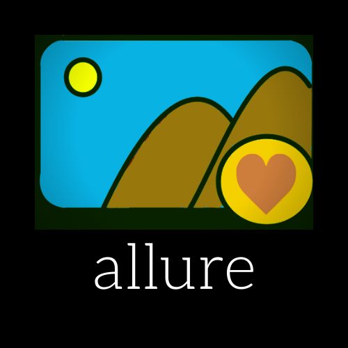
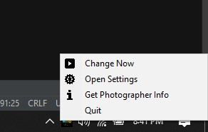

# allure the wallpaper app :mountain_snow:
allure downloads High Resolution pictures from UnSplash.com and sets them as your Desktop Wallpaper.

allure features:  
    - use keywords to search wallpapers  
    - set  wallpaper change interval from every 5 minutes to once a day  
    - change image buffer size to save space (>=12 && <=30)  
    - use your own api access key  
    - lives in your SystemApp Tray, no installation required  
    - make changes to config via cmd and SystemApp Tray icon  
    

feel free to fork and make your own changes or hit me up for feature ideas! :vulcan_salute:

Peace :v:

            *////////////((((((((((((((((((((((((((((((((((((((((((((//////////////*               
         /////////////(((((((((((((((((((((((((((((((((((((((((((((((((//////////////             
        /////////      ,(((((((((((((((((((((((((((((((((((((((((((((((((/////////////            
        ///////  ####### (((((((((((((((((((((((((((((((((((((((((((((((((*       ////            
        /////// ########  (((((((((((((((((((((((((((((((((((((((((((((. .*********  /            
        ///////, ######  ((((((((((((((((((((((((((((((((((((((((((((  **************             
        //////((((,   /((((((((((((((((((((((((((((((/(((((((((((((  *****************            
        /////(((((((((((((((((((((((((((((((((   ********  ,(((((/ *******************            
        /////((((((((((((((((((((((((((((((  ***************  ((  ********************            
        ////((((((((((((((((((((((((((((. ,*******************. **********************            
        /////(((((((((((((((((((((((((  *********************. ***********************            
        /////(((((((((((((((((((((((. **********************  ****    .(##(.    ******            
        /////(((((((((((((((((((((( ,********************** ,*,  ((((((((((((((((. .**            
        /////((((((((((((((((((((  **********************, *, (((((((((((((////((((( .            
        //////(((((((((((((((((/ ,**********************  *  ((((((((((((////////((((             
        ///////(((((((((((((((  ***********************  *, ((((((((((((((///////((((/            
        ////////((((((((((((( ,*********************** .**. ((((((((((((/////////(((//            
        *////////((((((((((/ ***********************/ ***** ((((((/((((/////////(((///            
          /////////(((((((  ***********************. ******* ((((((((////////(((((///             
                                                               ((((((((///((((((///               
                                                                  /(((((((((((//                  
  
  
                                 @@   @@                                                          
                                  @    @                                                          
                        @/   @    @    @    @     @    @ (     @   @                              
                             @    @    @    @     @    @      %/////@                             
                        @    @    @    @    @     @    @      @                                   
                        #@%@ ,@. @@@# @@@#   @@@@ @@  @@@.     ,@@@@                              
